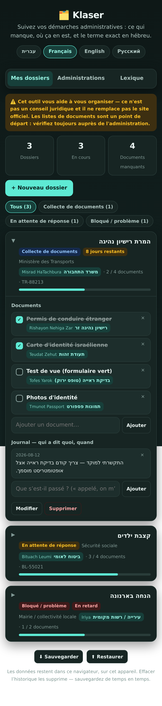

# 🗂️ קלסר / Klaser

A single-page tool for keeping track of Israeli bureaucracy: which case is at
which stage, which documents are still missing, and — the part that actually
trips people up — **what the thing is called in Hebrew**.

Built for anyone who finds Israeli forms hard, and especially for Olim Hadashim.
The interface is available in **עברית · Français · English · Русский**.

**The name:** קלסר (*klaser*) is the ring binder that every household dealing
with Israeli bureaucracy ends up keeping. This is that binder.

## The idea

Translating the interface is only half the problem. At the counter, on the form,
and on the phone, everything is in Hebrew. So every agency, document and term is
shown **with its Hebrew name and a transliteration next to it, in every
language** — you can hand the phone to the clerk, or read the transliteration
out loud.

## What it does

- **Cases** — one per process you have open. Stage, reference number, opening
  date and deadline. Deadlines inside two weeks are flagged; overdue ones go red.
- **Documents** — each case gets a checklist. Twelve common processes come with
  their document list pre-filled; you can add your own items to any case.
- **Log** — a dated note for every phone call and visit. Who said what, and when.
  This is the part that wins arguments later.
- **Agency directory** — Bituach Leumi, the Population Authority, the Ministry
  of Aliyah, the Tax Authority, municipalities, health funds and others, each
  with its Hebrew name, phone shortcut and official link.
- **Glossary** — the ~25 words you will actually hear at a counter (תור, אסמכתא,
  זכאות, השלמת מסמכים…). Searchable in any of the four languages at once.
- **Backup / restore** — export everything to a JSON file and read it back.

## Running it

No build, no dependencies, no server. Open `index.html` in a browser.

To deploy: GitHub Pages from the repository root. The empty `.nojekyll` file
stops Jekyll from touching it.

## Privacy

Everything is stored in `localStorage`, in your browser, on your device. Nothing
is uploaded and there is no analytics or tracking of any kind — which matters,
because these are case numbers and immigration records. The flip side is that
clearing your browser history deletes it, so the backup button is worth using.

## Editing the content

All content and reference data sits in named objects at the top of the `<script>`
block in `index.html`. No logic is language-specific.

| Object | What it holds |
|---|---|
| `LANGS` | Available languages and their text direction |
| `STR` | Every interface string, keyed by language |
| `STATUSES` | The stages a case moves through |
| `AGENCIES` | Agencies: names per language, Hebrew name, transliteration, phone, URL |
| `DOCS` | Reusable documents, named in each language |
| `TEMPLATES` | Known processes → agency + starting document list |
| `GLOSSARY` | Hebrew terms with transliteration and translations |

**Adding a language** means adding one entry to `LANGS` and one key to each
object above. RTL is handled by the `dir` field, and the layout uses logical CSS
properties throughout, so a new RTL language needs no CSS changes.

**Adding a process** means one entry in `TEMPLATES` pointing at an agency and a
list of `DOCS` keys.

## Accuracy

The document lists are a starting point drawn from what these processes commonly
require — not an official checklist, and requirements differ by personal
circumstance and change over time. Phone numbers and hours change too. Each
agency entry links to its official page, and the app says this in the interface
rather than burying it here. It is not legal advice.

## License

MIT.
